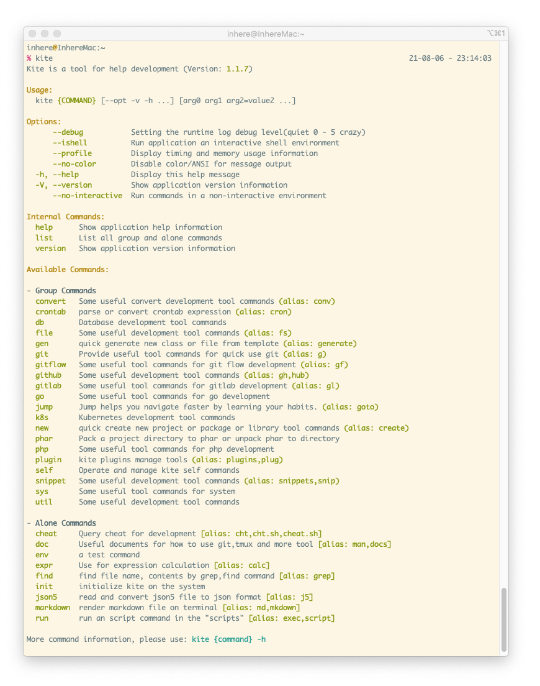

# Kite [中文说明](README.md)

[](LICENSE)
[](https://packagist.org/packages/inhere/console)
[](https://github.com/inhere/kite)
[](https://github.com/inhere/kite/actions)

Kite is a tool for help development.

> GitHub https://github.com/inhere/kite 
> kite is build on the [inhere/php-console](https://github.com/inhere/php-console)



## Install

**Required:**

- git
- php 7.3+
- composer

### Install by script

> file: [install.sh](./install.sh)

```bash
curl https://raw.githubusercontent.com/inhere/kite/master/install.sh | bash
```

### Manual clone

```bash
cd ~
git clone https://github.com/inhere/kite .kite
cd .kite
composer install
chmod a+x bin/kite
ln -s $PWD/bin/kite /usr/local/bin/kite
```

### Download phar

- release page: https://github.com/inhere/kite/releases

eg:

```bash
wget -c https://github.com/inhere/kite/releases/download/v1.0.5/kite-v1.0.5.phar
mv kite-v1.0.5.phar /usr/local/bin/kite
chmod a+x /usr/local/bin/kite
```

## Usage

### How to use

Display commands:

```bash
kite
kite list
```

Display help:

```bash
kite -h
kite --help
kite help
```

## Update

### Builtin command

Use builtin command for update tool to latest

```bash
kite upself
```

### Manual update

```bash
cd ~/.kite
git pull
chmod a+x bin/kite
```

## Build Phar

```bash
php -d phar.readonly=0 bin/kite phar:pack -o kite.phar
```


## Uninstall

```bash
rm -f /usr/local/bin/kite
rm -rf ~/.kite
```

## Dep Packages

- https://github.com/inhere/php-console
- https://github.com/php-toolkit/cli-utils
- https://github.com/php-toolkit/stdlib

## Thanks

- linux command docs by https://github.com/jaywcjlove/linux-command
