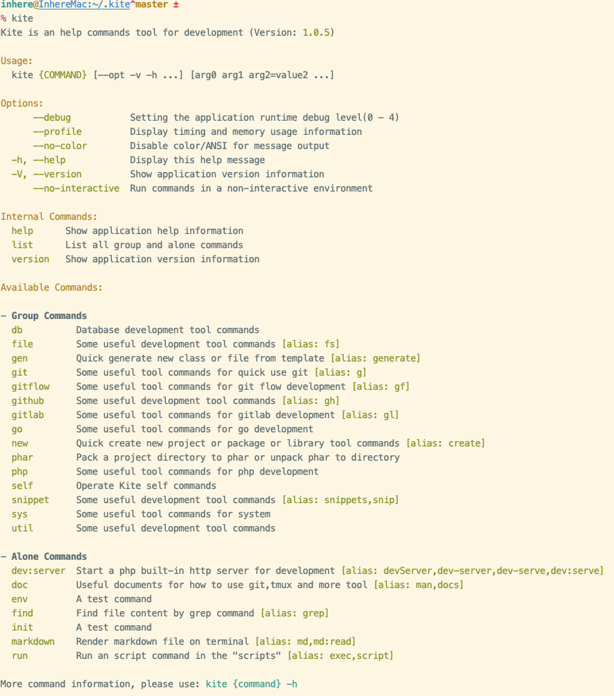
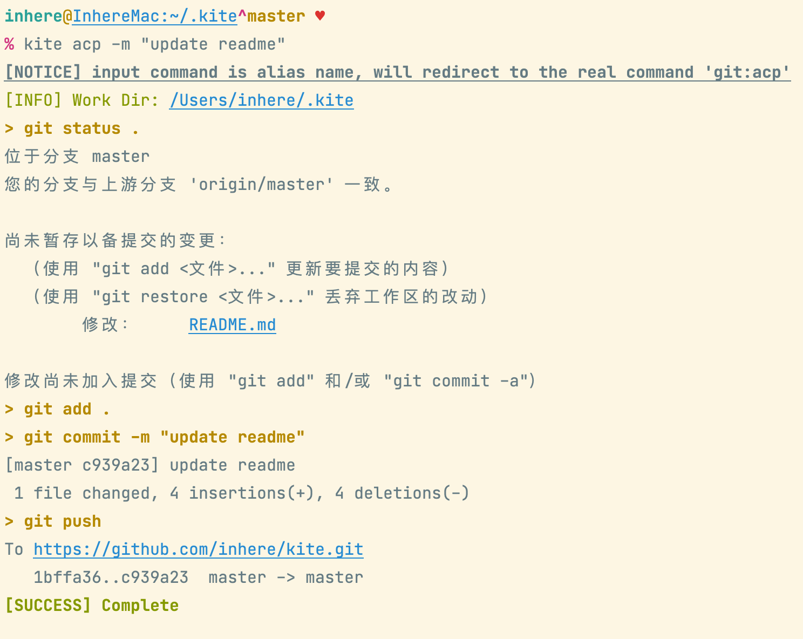
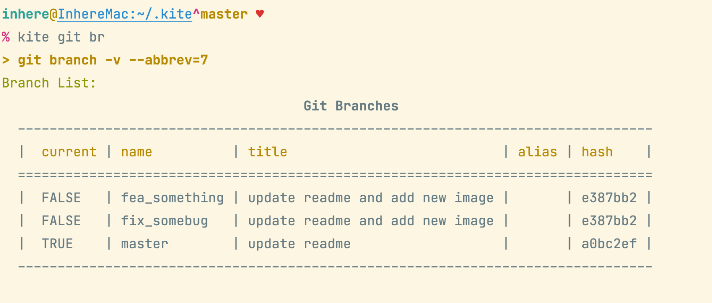
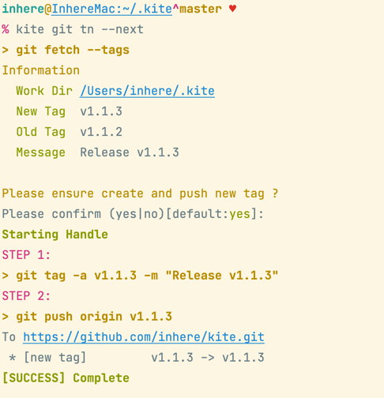
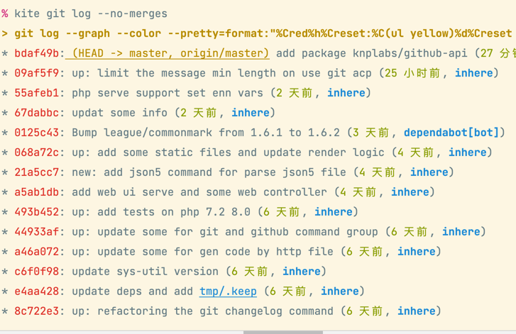
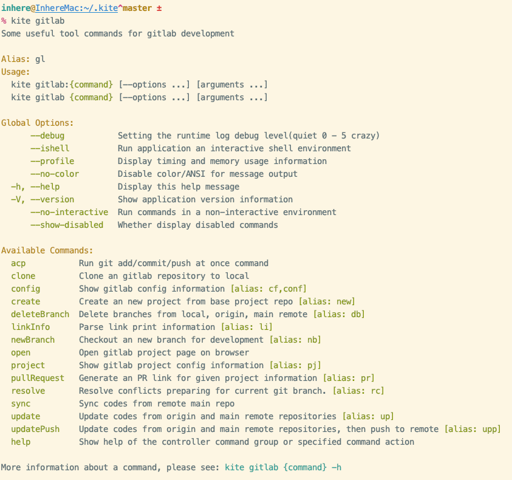
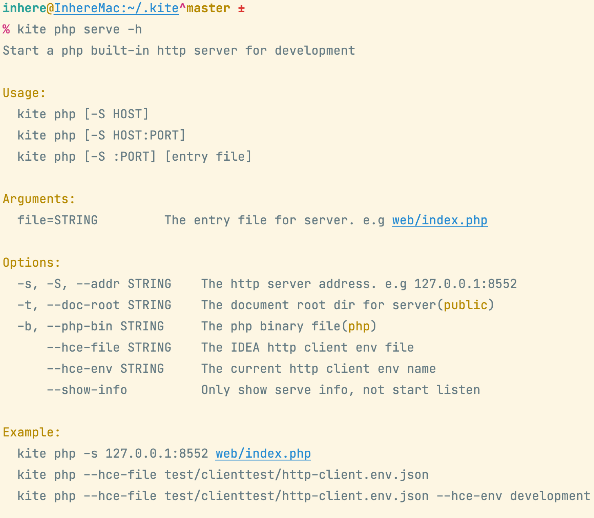
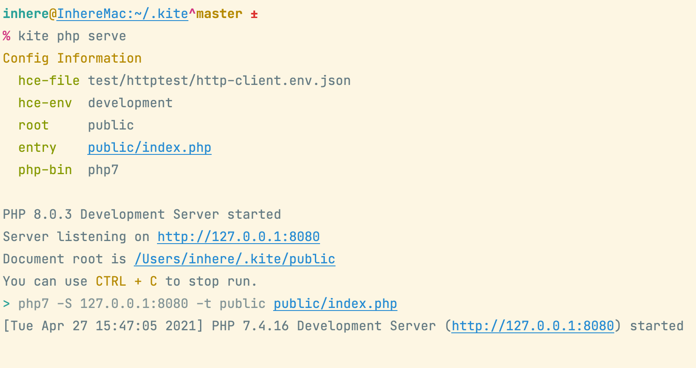
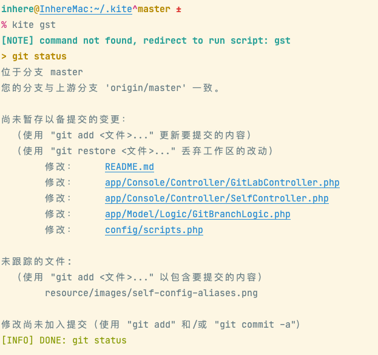
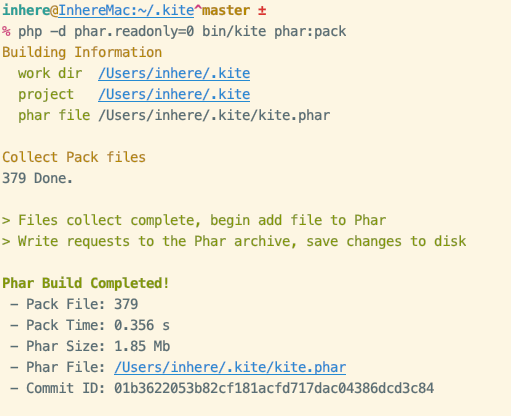

# Kite

[](LICENSE)
[](https://packagist.org/packages/inhere/console)
[](https://github.com/inhere/kite)
[](https://github.com/inhere/kite/actions)

PHP编写的个人CLI工具包，方便本地开发和使用的一些工具。

> [kite](https://github.com/inhere/kite) 是基于 [inhere/php-console](https://github.com/inhere/php-console) 命令行包编写的CLI应用

主要封装常用操作命令：

- `git`
- `gitlab`
- `github`
- `php`
- `env`

## [English](README.md)

## 安装

**系统环境依赖**

- git
- php 7.2+
- composer

**脚本安装**

> file: [install.sh](./install.sh)

```bash
curl https://raw.githubusercontent.com/inhere/kite/master/install.sh | bash
```

**手动安装**

```bash
cd ~
git clone https://github.com/inhere/kite .kite
cd .kite
composer install
ln -s $PWD/bin/kite /usr/local/bin/kite
chmod a+x bin/kite
```

**下载PHAR**

- Release page: https://github.com/inhere/kite/releases

注意替换为最新的版本号:

```bash
wget -c https://github.com/inhere/kite/releases/download/v1.0.5/kite-v1.0.5.phar
mv kite-v1.0.5.phar /usr/local/bin/kite
chmod a+x /usr/local/bin/kite
```

## 使用说明

### 查看命令帮助

```bash
kite -h
```



## Git 使用

主要提供git使用中的一些常用命令封装

### 命令格式

```bash
kite git {COMMAND} [arguments ...] [--options ...]
```

### Git常用命令

下面是一些常用命令说明，关于每个命令的详细使用和更多参数请使用 `kite git COMMAND -h` 查看

> TIPS: 特殊的，`kite git COMMAND` 如果你输入的命令不存在，会尝试执行系统的 `git COMMAND`

**快速提交**

```bash
kite git ac -m "commit message"
```

**快速提交并推送**

```bash
kite git acp -m "commit message"
# 可以使用别名快速操作
kite acp -m "commit message"
```

> TIPs: `acp` 是 `git:acp` 命令的别名，你也可以添加自己常用的别名到 `~/.kite/.kite.php`



**查看分支列表**

默认查看本地分支列表

```bash
kite git branch
# 别名
kite git br
```



更多示例：

```bash
# 列出所有，包含remotes的分支列表
kite git br -a
# 查看本地分支列表并根据关键字 'fix' 搜索
kite git br -s fix
# 查看指定remote的分支列表
kite git br -r origin
kite git br -r main
kite git br -r main -s fix
# 仅简单的打印分支名称
kite git br --only-name
# 仅打印分支名称并且以逗号分割显示在一行
kite git br --only-name
```

**快速创建tag并推送到远端**

```bash
kite git tag-push -v v1.0.2 -m "release new version"
# 简写别名
kite git tn -v v1.0.2 -m "release new version"
# 自动计算和创建下一个版本分支
kite git tn --next
```



**查看最近的变动历史**

```bash
kite git log
# 别名
kite git lg
```



**查看两个版本直接的变动历史**

命令：`kite git changelog` (别名: `cl` `chlog`)

> 详细的选项和参数请使用 `kite git cl -h` 查看

查看两个版本直接的变动历史，自动根据commit logs生成变动历史记录。
默认生成markdown格式的，可以直接复制粘贴使用，也支持生成并输出到指定文件中。

```bash
kite git cl v1.1.2 v1.1.3
# 可以使用关键字
kite git cl last head
kite git cl prev last
```

带额外选项示例：

```bash
kite git changelog last head --style gh-release --no-merges
kite git changelog v2.0.9 v2.0.10 --no-merges --style gh-release --exclude "cs-fixer,format codes"
```


## Gitlab 使用

主要用于fork模式的快速开发提供的一些常用命令封装

### 命令格式

命令：`gitlab` (别名：`gl`)

```bash
kite gitlab {command} [arguments ...] [--options ...]
```

### 相关配置

这是默认配置，如果你的使用习惯不同，请通过用户配置文件(`~/.kite/.kite.php`)调整覆盖 

```php
'gitlab' => [
    // remote
    'mainRemote' => 'main',
    'forkRemote' => 'origin',
],
```

### 命令使用

下面是一些常用命令说明，关于每个命令的详细使用和更多参数请使用 `kite gl COMMAND -h` 查看

**查看命令列表**



**快速创建分支**

会自动切到master分支，同时更新代码到最新，然后创建新分支

```bash
kite gl nb fix_210423
```

**更新本地仓库代码**

同时会从 `fork remote` 和 `主仓库remote` 的对应分支和 `master` 拉取同步代码

```bash
kite gl update
# 简写别名
kite gl up
```

**更新本地仓库代码并推送**

同时会从 `fork remote` 和 `主仓库remote` 的对应分支和 `master` 拉取同步代码，并且最后会推送到远端

```bash
kite gl updatePush
# 简写别名
kite gl upp
```

> TIPS: 多人协同开发一个项目仓库时，推荐经常进行同步，避免出现代码冲突

**向主仓库发PR**

操作不会直接创建PR，只会打开浏览器并跳转到PR页面，并自会动选择好对应分支

```bash
# -o 不跟分支，默认会从当前分支 发起到主仓库 对应的当前分支的PR
kite gl pr -o
# -o 跟分支，则会从当前分支 发起到主仓库 里给定分支的PR
kite gl pr -o qa
kite gl pr -o pre
kite gl pr -o master
```

**浏览器打开仓库**

在项目所在目录执行如下命令，即可自动使用默认浏览器打开仓库页面

```bash
# 打开Fork仓库地址(即origin对应的)
kite gl open
# 打开主仓库地址
kite gl open --main
```

**快速删除分支**

快速地删除多个分支

```bash
kite gl db 'fix_210423,fix_210321'
# 强制执行，忽略执行中的错误
kite gl db 'fix_210423,fix_210321' -f
```

## Github 使用

主要用于GitHub git快速使用提供的一些常用命令封装

### 命令格式

命令：`github` (别名：`gh, hub`)

```bash
kite github {command} [arguments ...] [--options ...]
```

配置:

```php
'github' => [
    // remote
    'mainRemote' => 'main', // 'source'
    'forkRemote' => 'origin',
    'redirectGit'   => [
        'acp',
        'log',
        'info',
        'push',
        'fetch',
        'update',
        'tagNew',
        'changelog',
    ],
],
```

> **提示** 如配置所示，允许你直接重定向命令到 `git` 命令组执行。
> 即 `gh log` 实际上执行的是 `git log`，因此在 `git` 下面能用的，`gh` 下也都可用。

**向主仓库发PR**

操作不会直接创建PR，只会打开浏览器并跳转到PR页面，并自会动选择好对应分支

```bash
# -o 不跟分支，默认会从当前分支 发起到主仓库 对应的当前分支的PR
kite gl pr -o
# -o 跟分支，则会从当前分支 发起到主仓库 里给定分支的PR
kite gl pr -o main
kite gl pr -o master
```

**在浏览器打开仓库**

```bash
kite gh open
```

## 其他常用命令

**kite json5**

`json5` 文件格式读取，转换为 `json`

### php开发服务器

`kite php serve` 可以快速启动一个php开发服务器。



**命令配置**

可用通过配置来设置默认的信息，这样就不用每次启动时设置参数了

```php
    'php:serve'     => [
        'hce-file' => 'test/clienttest/http-client.env.json',
        'hce-env'  => getenv('APP_ENV') ?: 'dev',
        // document root
        'root'     => 'public',
        'entry'    => 'public/index.php',
        'php-bin'  => 'php7'
        // 'addr' => '127.0.0.1:8552',
    ],
```

**IDEA http-client环境**

内置支持IDEA的http-client环境文件。如果你需要同时开发多个项目，都需要启动serve，此时一份通用的配置显然不行了(_同时启动会端口冲突_)。

这时 `hce-file`, `hce-env` 就可以排上用场，可以在每个项目里添加一份http-client环境文件，并且规划好每个服务的端口

示例文件 [test/clienttest/http-client.env.json](test/clienttest/http-client.env.json)

```json
{
  "dev": {
    "host": "127.0.0.1:10106"
  },
  "test": {
    "host": "127.0.0.1:10106"
  }
}
```

这样在不同项目下，通过 `kite php serve` 运行服务时，会自动读取当前环境的 `host` 设置作为启动服务的server地址。

```bash
kite php serve
```

输出示例：



### ENV环境信息

显示全部环境变量信息：

```bash
kite env
```

输出 `PATH` 信息：

```bash
$ kite env path
Path Value
  /usr/local/sbin
  /usr/local/bin
  /usr/bin
  /bin
  /usr/sbin

```

搜索环境变量或指定显示某个环境变量:

```bash
$ kite env ter
Matched Results(Kw:ter)
  TERMINAL_EMULATOR JetBrains-JediTerm
  TERM              xterm-256color
  ZSH_TMUX_TERM     screen-256color

```

> Tips: 当 `kite env` 后面跟的是一个存在的环境变量名时，直接显示这个环境变量信息；否则进行模糊匹配，显示所有匹配的变量信息

## 扩展使用

### 使用简单脚本

除了使用内部提供的命令，`kite` 也提供了快速的 `scripts` 脚本配置。

下面是一份默认的快捷 `scripts` 配置，你同样可以通过用户配置文件 `~/.kite/.kite.php` 添加自己的脚本命令

```php
<?php

// custom scripts for quick run an command
return [
    'echo' => 'echo hi',
    'test' => [
        'echo $SHELL',
        'echo hello'
    ],
    // git quick use
    'gst'  => 'git status',
    'st'   => 'git status',
    'co'   => 'git checkout $@',
    'br'   => 'git branch $?',
    'pul'  => 'git pul $?',
    'pull' => 'git pull $?',
];
```

当你执行 `kite gst` 时，会直接调用系统的 `git status` 命令。

**使用示例**

```bash
kite gst
```



### 命令别名配置

默认的命令别名请看 [config/config.php](config/config.php) 文件中的 `aliaes` 配置

```php
    // command aliases. element is: alias command => real command
    'aliases' => [
        'ac'     => 'git:ac',
        'acp'    => 'git:acp',
        'glpr'   => 'gitlab:pr',
        'config' => 'self config',
    ],
```

你可以添加自己常用的别名到 `~/.kite/.kite.php` 用户配置文件中


### 命令插件

kite 里除了提供 `scripts` 访问执行外部命令，还可以编写自定义插件命令实现一些自定义功能

**配置**

首先配置插件目录，支持配置多个目录。

```php
    'pluginDirs' => [
        '~/.kite/plugin/'
    ],
```

**编写插件命令**

每个插件命令文件都是一个 php 类文件，需要继承 `Inhere\Kite\Console\Plugin\AbstractPlugin`

这是 [demo-pulgin](plugin/demo-plugin.php) 文件示例：

```php
<?php

use Inhere\Console\IO\Input;
use Inhere\Kite\Console\Application;
use Inhere\Kite\Console\Plugin\AbstractPlugin;

/**
 * Class DemoPlugin
 */
class DemoPlugin extends AbstractPlugin
{
    public function metadata(): array
    {
        return [
            'desc' => 'this is am demo plugin',
        ];
    }

    public function exec(Application $app, Input $input): void
    {
        vdump(__METHOD__);
    }
}
```

> 注意：插件文件名必须跟里面的插件类保持一致。kite会自动将插件名进行驼峰格式转换当做类名称使用，因此可以在文件名使用连字符 `-`。

**运行插件命令**

kite 通过内部的 `plugin run` 命令紧跟插件名或者插件路径来运行一个插件。

```bash
kite plugin run PLUGIN_NAME
```

kite将会在插件目录里找到对应插件文件并执行它的 `exec` 方法。如下面的命令就会找到 `demo-plugin` 并运行它。

```bash
kite plugin run demo-plugin
```

可以省略 `plugin run` 直接跟插件名称来快速执行插件。

> TIPS: 其原理跟运行script类似，kite找不到命令，就会自动尝试检查是否是一个插件命令，能找到插件文件，就会当做插件执行。

```bash
# 后缀 .php 可以忽略
kite demo-plugin
kite demo-plugin.php
# 直接写完整路径也是可以的
kite plugin/demo-plugin
kite plugin/demo-plugin.php
```

## 更新kite

**内置命令**

使用内置命令将更新工具更新到最新版本

```bash
kite selfupdate
```

**手动更新**

```bash
cd ~/.kite
git pull
chmod a+x bin/kite
```

## 构建Phar包

```bash
php -d phar.readonly=0 bin/kite phar:pack
```



## 删除工具

```bash
rm -f /usr/local/bin/kite
rm -rf ~/.kite
```

## Dep Packages

- https://github.com/inhere/php-console
- https://github.com/php-toolkit/cli-utils
- https://github.com/php-toolkit/sys-utils
- https://github.com/php-toolkit/stdlib
- https://github.com/ulue/phpgit

## Refer

- linux command docs by https://github.com/jaywcjlove/linux-command
