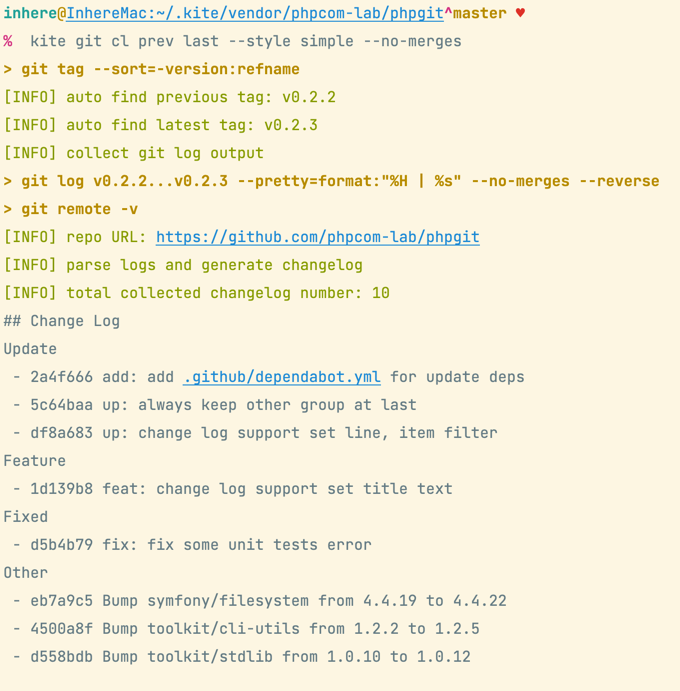
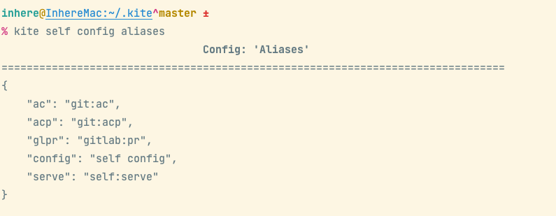

# Kite

[](LICENSE)
[](https://packagist.org/packages/inhere/console)
[](https://github.com/inhere/kite)
[](https://github.com/inhere/kite/actions)

PHP编写的个人CLI工具包

> Github https://github.com/inhere/kite

主要封装了：

- git 常用命令操作
- gitlab 常用命令操作

## [English](README.md)

## 安装

**系统环境依赖**

- git
- php 7.2+
- composer

**脚本安装**

> file: [install.sh](./install.sh)

```bash
curl https://raw.githubusercontent.com/inhere/kite/master/install.sh | bash
```

**手动安装**

```bash
cd ~
git clone https://github.com/inhere/kite .kite
cd .kite
composer install
ln -s $PWD/bin/kite /usr/local/bin/kite
chmod a+x bin/kite
```

**下载PHAR**

- Release page: https://github.com/inhere/kite/releases

注意替换为最新的版本号:

```bash
wget -c https://github.com/inhere/kite/releases/download/v1.0.5/kite-v1.0.5.phar
mv kite-v1.0.5.phar /usr/local/bin/kite
chmod a+x /usr/local/bin/kite
```

## 使用说明

### 查看命令帮助

```bash
kite -h
```


## Git 使用

主要提供git使用中的一些常用命令封装

### 命令格式

```bash
kite git {COMMAND} [arguments ...] [--options ...]
```

### Git常用命令

下面是一些常用命令说明，关于每个命令的详细使用和更多参数请使用 `kite git COMMAND -h` 查看

> TIPS: 特殊的，`kite git COMMAND` 如果你输入的命令不存在，会尝试执行系统的 `git COMMAND`

**快速提交**

```bash
kite git ac -m "commit message"
```

**快速提交并推送**

```bash
kite git acp -m "commit message"
# 可以使用别名快速操作
kite acp -m "commit message"
```

> TIPs: `acp` 是 `git:acp` 命令的别名，你也可以添加自己常用的别名到 `~/.kite/.kite.inc`


**查看分支列表**

默认查看本地分支列表

```bash
kite git branch
# 别名
kite git br
```


更多示例：

```bash
# 列出所有，包含remotes的分支列表
kite git br -a
# 查看本地分支列表并根据关键字 'fix' 搜索
kite git br -s fix
# 查看指定remote的分支列表
kite git br -r origin
kite git br -r main
kite git br -r main -s fix
# 仅简单的打印分支名称
kite git br --only-name
# 仅打印分支名称并且以逗号分割显示在一行
kite git br --only-name
```

**快速创建tag并推送到远端**

```bash
kite git tag-push -v v1.0.2 -m "release new version"
# 简写别名
kite git tn -v v1.0.2 -m "release new version"
# 自动计算和创建下一个版本分支
kite git tn --next
```


**查看最近的变动历史**

```bash
kite git changelog
# 别名
kite git cl
```



## Gitlab 使用

主要用于fork模式的快速开发提供的一些常用命令封装

### 命令格式

命令：`gitlab` (别名：`gl`)

```bash
kite gitlab {command} [arguments ...] [--options ...]
```

### 相关配置

这是默认配置，如果你的使用习惯不同，请通过用户配置文件(`~/.kite/.kite.inc`)调整覆盖 

```php
'gitlab' => [
    // remote
    'mainRemote'       => 'main',
    'forkRemote'       => 'origin',
],
```

### 命令使用

下面是一些常用命令说明，关于每个命令的详细使用和更多参数请使用 `kite gl COMMAND -h` 查看

**查看命令列表**


**快速创建分支**

会自动切到master分支，同时更新代码到最新，然后创建新分支

```bash
kite gl nb fix_210423
```

**更新本地仓库代码**

同时会从 `fork remote` 和 `主仓库remote` 的对应分支和 `master` 拉取同步代码

```bash
kite gl update
# 简写别名
kite gl up
```

**更新本地仓库代码并推送**

同时会从 `fork remote` 和 `主仓库remote` 的对应分支和 `master` 拉取同步代码，并且最后会推送到远端

```bash
kite gl updatePush
# 简写别名
kite gl upp
```

> TIPS: 多人协同开发一个项目仓库时，推荐经常进行同步，避免出现代码冲突

**向主仓库发PR**

操作不会直接创建PR，只会打开浏览器并跳转到PR页面，并自会动选择好对应分支

```bash
# -o 不跟分支，默认会从当前分支 发起到主仓库 对应的当前分支的PR
kite gl pr -o
# -o 跟分支，则会从当前分支 发起到主仓库 里给定分支的PR
kite gl pr -o qa
kite gl pr -o pre
kite gl pr -o master
```

**浏览器打开仓库**

在项目所在目录执行如下命令，即可自动使用默认浏览器打开仓库页面

```bash
# 打开Fork仓库地址(即origin对应的)
kite gl open
# 打开主仓库地址
kite gl open --main
```

**快速删除分支**

快速地删除多个分支

```bash
kite gl db 'fix_210423,fix_210321'
# 强制执行，忽略执行中的错误
kite gl db 'fix_210423,fix_210321' -f
```

## 其他工具命令

**env**

显示环境变量信息：

```bash
kite env
```

输出 `PATH` 信息：

```bash
kite env path
```

## 使用简单脚本

除了使用内部提供的命令，`kite` 也提供了快速的 `scripts` 脚本配置。

下面是一份默认的快捷 `scripts` 配置，你同样可以通过用户配置文件 `~/.kite/.kite.inc` 添加自己的脚本命令

```php
<?php

// custom scripts for quick run an command
return [
    'echo' => 'echo hi',
    'test' => [
        'echo $SHELL',
        'echo hello'
    ],
    // git quick use
    'gst'  => 'git status',
    'st'   => 'git status',
    'co'   => 'git checkout $@',
    'br'   => 'git branch $?',
    'pul'  => 'git pul $?',
    'pull' => 'git pull $?',
];
```

当你执行 `kite gst` 时，会直接调用系统的 `git status` 命令。

**使用示例**

```bash
kite gst
```


## 命令别名配置

默认的命令别名请看 [config/config.php](config/config.php) 文件中的 `aliaes` 配置

```php
    // command aliases. element is: alias command => real command
    'aliases' => [
        'ac'     => 'git:ac',
        'acp'    => 'git:acp',
        'glpr'   => 'gitlab:pr',
        'config' => 'self config',
    ],
```

你可以添加自己常用的别名到 `~/.kite/.kite.inc` 用户配置文件中



## 更新

**内置命令**

使用内置命令将更新工具更新到最新版本

```bash
kite selfupdate
```

**手动更新**

```bash
cd ~/.kite
git pull
chmod a+x bin/kite
```

## 构建Phar包

```bash
php -d phar.readonly=0 bin/kite phar:pack
```


## 删除工具

```bash
rm -f /usr/local/bin/kite
rm -rf ~/.kite
```

## Dep Packages

- https://github.com/inhere/php-console
- https://github.com/php-toolkit/cli-utils
- https://github.com/php-toolkit/sys-utils
- https://github.com/php-toolkit/stdlib
- https://github.com/ulue/phpgit

## Thanks

- linux command docs by https://github.com/jaywcjlove/linux-command
