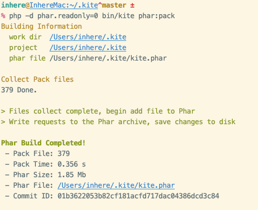

# Kite

[](LICENSE)
[](https://packagist.org/packages/inhere/console)
[](https://github.com/inhere/kite)
[](https://github.com/inhere/kite/actions)

My person CLI tool package.

> Github https://github.com/inhere/kite

## [English](README.md)

## 安装

**Required:**

- git
- php 7.1+
- composer

### 脚本安装

> file: [install.sh](./install.sh)

```bash
curl https://raw.githubusercontent.com/inhere/kite/master/install.sh | bash
```

### 手动安装

```bash
cd ~
git clone https://github.com/inhere/kite .kite
cd .kite
composer install
ln -s $PWD/bin/kite /usr/local/bin/kite
chmod a+x bin/kite
```

### 下载PHAR

- release page: https://github.com/inhere/kite/releases

eg:

```bash
wget -c https://github.com/inhere/kite/releases/download/v1.0.5/kite-v1.0.5.phar
mv kite-v1.0.5.phar /usr/local/bin/kite
chmod a+x /usr/local/bin/kite
```

## 使用帮助

```bash
kite -h
```


## 更新

### 内置命令

Use builtin command for update tool to latest

```bash
kite self:update
```

### 手动更新

```bash
cd ~/.kite
git pull
chmod a+x bin/kite
```

## 构建Phar包

```bash
php -d phar.readonly=0 bin/kite phar:pack
```



## Uninstall

```bash
rm -f /usr/local/bin/kite
rm -rf ~/.kite
```

## Dep Packages

- https://github.com/inhere/php-console
- https://github.com/php-toolkit/cli-utils
- https://github.com/php-toolkit/stdlib

## Thanks

- linux command docs by https://github.com/jaywcjlove/linux-command
